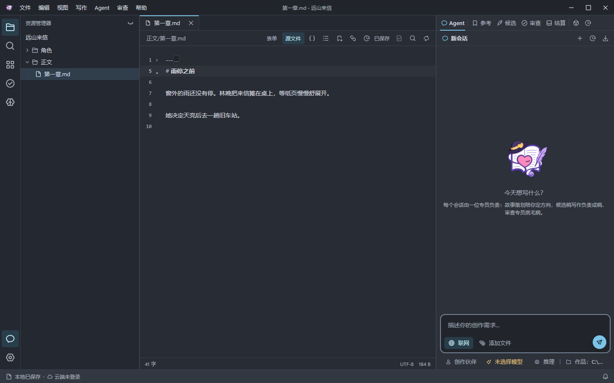
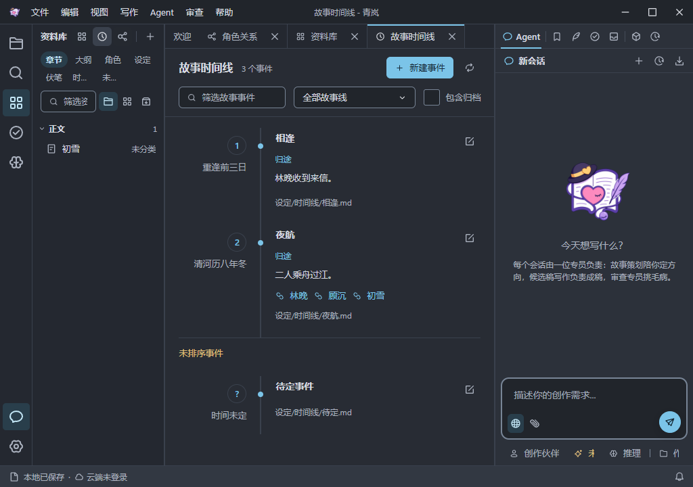
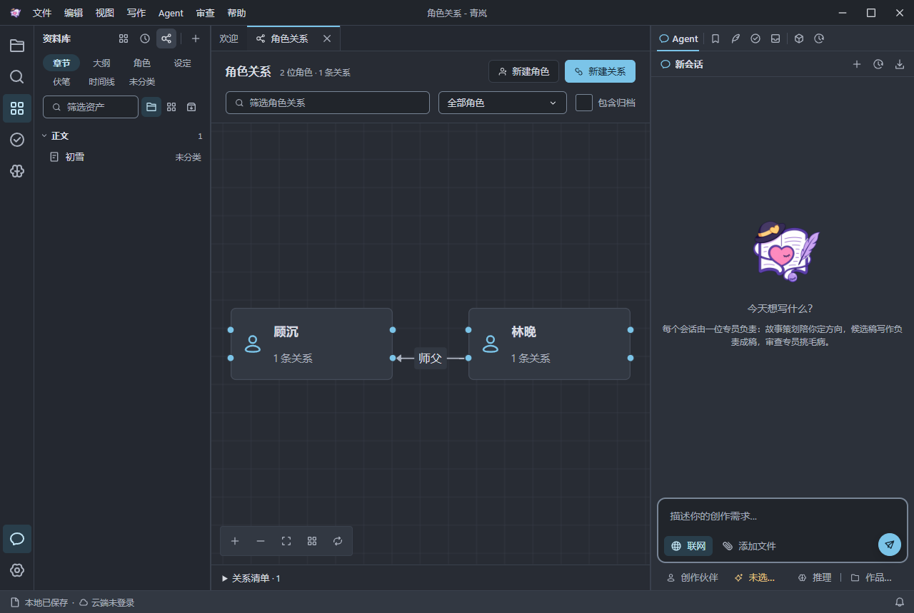

<p align="center">
  
</p>

<h1 align="center">Chaptale</h1>

<p align="center">长篇创作工作台 · 章节、故事资料与 AI 协作</p>

<p align="center">
  <a href="https://github.com/Yoyo-514/Chaptale/actions/workflows/ci.yml"></a>
  <a href="https://github.com/Yoyo-514/Chaptale/releases"></a>
  <a href="./LICENCE"></a>
  <a href="https://github.com/Yoyo-514/Chaptale/releases"></a>
</p>

<p align="center">
  <a href="https://github.com/Yoyo-514/Chaptale/releases">下载安装</a> ·
  <a href="./docs/guide/getting-started.md">使用手册</a> ·
  <a href="./CONTRIBUTING.md">开发与贡献</a> ·
  <a href="https://github.com/Yoyo-514/Chaptale/issues">问题反馈</a>
</p>

Chaptale 是面向小说、剧本等长篇作品的桌面写作工具。正文、角色、设定和故事事件保存在你选定的本机目录中，写作时可以随手查阅资料、梳理时间线和角色关系。

AI 功能按写作任务组织：先选参考资料，再生成候选稿、比较修改，也可以单独检查情节连贯性、角色行为与文风。不配置模型时，仍可编辑章节和管理资料。



## 主要功能

| 功能         | 当前可以做什么                                                                 |
| ------------ | ------------------------------------------------------------------------------ |
| 章节编辑     | Markdown、多标签、查找替换、字数统计、自动保存、外部修改冲突处理               |
| 故事资料     | 用模板记录角色、地点、势力、物品、大纲、伏笔和场景卡；通过表单或源文件编辑     |
| 时间线与关系 | 按故事顺序查看事件，按故事线筛选，在画布中查看和编辑角色关系                   |
| AI 写作      | 选择和冻结参考资料，生成候选稿，按差异块接受修改                               |
| 审查与结算   | 对正文或候选稿运行独立审查；将章节摘要、角色状态、伏笔和事件整理为可处理的提议 |
| 版本与备份   | 查看关键操作的文档快照；通过已配置的 Dropbox / OneDrive 保存和恢复作品归档     |
| 内容定制     | 管理专员、技能和资产模板，支持作品级与用户级内容、导入导出                     |

<details>
<summary>查看故事时间线与角色关系截图</summary>

### 故事时间线



### 角色关系



</details>

## 安装与开始使用

在 [Releases](https://github.com/Yoyo-514/Chaptale/releases) 下载对应安装包：

| 系统                        | 安装包                      |
| --------------------------- | --------------------------- |
| Windows x64                 | `.exe`                      |
| macOS Apple Silicon / Intel | 对应架构的 `.dmg` 或 `.zip` |
| Linux x64                   | `.deb` 或 `.AppImage`       |

1. 启动后新建作品，选择名称、类型和存放目录。
2. 打开第一章开始写作，使用 `Ctrl+S` 保存。
3. 需要 AI 时，在「设置 → 模型」添加自己的模型服务，并设置默认模型。

模型接入支持 **OpenAI Chat Completions、OpenAI Responses、Anthropic Messages、Google Generative AI** 接口类型；具体可用性取决于服务地址、凭据和接口兼容程度。详见[模型配置](./docs/ai/models.md)。

项目仍处于早期阶段。使用已有重要稿件前，请保留完整作品目录的备份；当前没有应用内自动更新，版本更新以 Releases 为准。

## AI 如何参与写作

| 环节 | 你需要决定的内容                     | 产物                             |
| ---- | ------------------------------------ | -------------------------------- |
| 参考 | 写作目标、涉及的章节和设定、参考预算 | 固定本次输入的参考快照           |
| 候选 | 修改范围、模型、接受哪些差异         | 可与正文对比的候选稿             |
| 审查 | 检查方向、哪些意见成立、是否提出修订 | 带原文定位的问题与修订候选       |
| 结算 | 接受、编辑或拒绝章节中提取的事实     | 摘要及角色、伏笔、事件资料的更新 |

这些环节可以分别使用。候选稿生成后不会立即替换正文；结算可以选择“本次自动接受摘要”，其他事实通过提议处理。Agent 对话还可调用文件工具，写入是否需要再次询问取决于已有的授权规则。操作说明见 [AI 协作流程](./docs/ai/workflow.md)。

## 数据与运行方式

- **作品文件**：正文和资料使用 Markdown 与文件头字段保存。表单、资料库和编辑器操作的是同一份源文件。
- **AI 服务**：使用自己配置的模型供应商。对话、附加文件和选定参考会随相应请求发送给该服务。
- **云端备份**：登录并绑定位置后生成作品归档；可用服务取决于应用构建时的配置。保存到本机不代表归档已上传。
- **内容扩展**：专员、技能和模板是可检查的内容文件。当前不提供任意代码插件或插件市场。

## 从源码运行

需要 **Node.js ≥ 24** 和 **pnpm 12.5.1**。

```sh
git clone https://github.com/Yoyo-514/Chaptale.git
cd Chaptale
pnpm install --frozen-lockfile
pnpm dev
```

### 项目结构

| 目录              | 职责                                                  |
| ----------------- | ----------------------------------------------------- |
| `apps/desktop`    | Electron 主进程与 preload，负责文件、模型、工具和备份 |
| `apps/desktop-ui` | Vue 3 + Pinia 界面，CodeMirror 编辑器                 |
| `packages/ipc`    | 进程间通信契约与校验                                  |
| `packages/shared` | 共享类型与逻辑                                        |
| `docs`            | VitePress 使用手册                                    |

项目使用 TypeScript、pnpm workspace 和 Turborepo；单元测试使用 Vitest，桌面端到端测试通过 Playwright 启动真实 Electron。开发检查、安装包构建与发布步骤见[开发与发布](./CONTRIBUTING.md)。

### 本地阅读文档

```sh
pnpm docs:dev
# 构建静态站点
pnpm docs:build
```

## 文档与反馈

- [快速开始](./docs/guide/getting-started.md)：创建作品并保存第一章。
- [编辑与资料管理](./docs/guide/editor.md)：日常写作、文件冲突和相关资料。
- [AI 协作](./docs/ai/workflow.md)：从参考到候选、审查与结算。
- [备份与恢复](./docs/data/backup.md)：完整作品归档与恢复方式。
- [常见问题](./docs/reference/faq.md)：配置、文件、模型与状态提示。

提交 [Issue](https://github.com/Yoyo-514/Chaptale/issues) 时请附上应用版本、操作系统、复现步骤和错误提示；先移除截图及日志中的密钥和私人作品内容。

## 许可证

[Apache License 2.0](./LICENCE)。第三方依赖保留各自的许可证。
